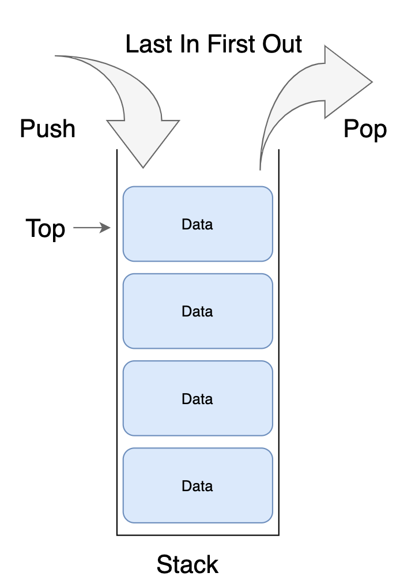
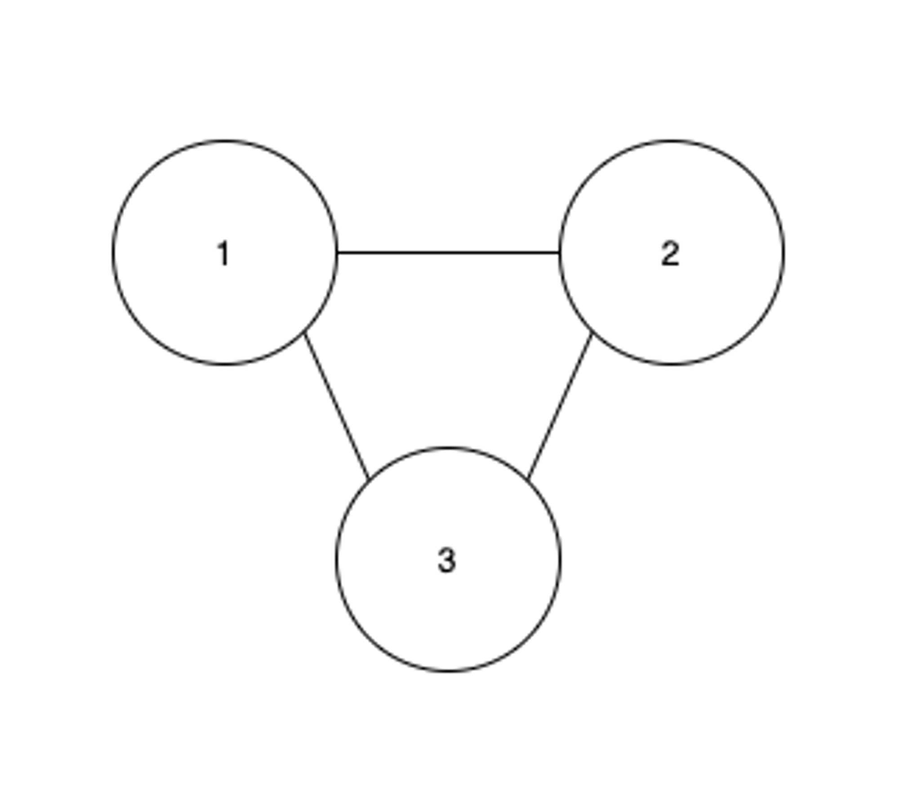
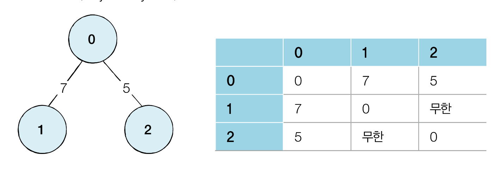

# 탐색 알고리즘

**탐색** : 많은 양의 데이터 중에서 원하는 데이터를 찾는 과정

주로 그래프, 트리 등의 자료구조 안에서 탐색하는 문제가 자주 출제 됩니다.

대표적인 탐색 알고리즘으론 DFS, BFS가 존재하는데 책에서는 이를 이해하기 위해 다음의 기초 자료구조를 설명해줍니다.


## 기초 자료구조

**자료구조** : 데이터를 표현하고 관리하고 처리하기 위한 구조

### 스택 & 큐

그택과 큐는 다음의 두가지 핵심적인 함수로 구성됩니다.
- 삽입 (Push) : 데이터 삽입
- 삭제 (Pop) : 데이터 삭제

**고려 사항**
- 오버플로 (Overflow) : 수용할 수 있는 데이터의 크기를 이미 가득 찬 상태에서 삽입 연산을 수행하는 경우
- 언더플로 (Underflow) : 데이터가 전혀 없는 상태에서 삭제 연산을 수행하는 경우

> todo : 이후 c++ STL velog 작성 및 링크 연결

#### 스택

```박스 쌓기```

> 선입 후출 FILO (First In Last Out)

다음의 그림의 형태로 존재합니다.



C++ 의 경우 다음의 링크의 글을 보면 method들을 확인할 수 있습니다. (추가 예정)

#### 큐
```대기 줄```

> 선입선출 FIFO (First In First Out)

다음의 그림의 형태로 존재합니다.

C++ 의 경우 다음의 링크의 글을 보면 method들을 확인할 수 있습니다. (queue)

#### 그래프

노드(정점)와 간선으로 표현됩니다.



위의 그림 중 노드와 간선의 예시는 다음과 같습니다.
- 노드 : 1, 2, 3
- 간선 : 노드를 연결하는 선

두 노드가 간선으로 연결 되어 있다면 '두 노드는 인접하다' 라고 표현합니다.

> 그래프 탐색이란 하나의 노드를 시작으로 다수의 노드를 방문하는 것을 의미합니다.

##### 프로그래밍에서의 그래프

위 그림을 2 가지 방식으로 표현할 수 있습니다.
- 인접 행렬 : 2차원 배열로 그래프의 연결 관계를 표현하는 방식
    #define INF 999999999
```#define INF 999999999

int graph[3][3] = {
    {0, 7, 5},
    {7, 0, INF},
    {5, INF, 0}
};

void print() {
    for(int i = 0; i < 3; i++) {
        for (int j = 0; j < 3; j++) {
            cout << graph[i][j] << ' '; 
        }
        cout << endl;
    }
}

int main() {
    print();
}
```
- 인접 리스트 : 리스트로 그래프의 연결 관계를 표현하는 방식
```
using namespace std;
#define INF 999999999

vector<pair<int, int> > graph[3];

void input() {
    // 노드, 거리 저장
    graph[0].push_back({1, 7});
    graph[0].push_back({2, 5});

    graph[1].push_back({0, 7});

    graph[2].push_back({0, 5});
}

void print() {
    for (int i = 0; i < 3; i++) {
        for (int j = 0; j < 3; j++) {
            cout << '(' << graph[i][j].first << ',' << graph[i][j].second << ')' << ' ';
        }
    }
}

int main() {
    input();
    print();
}
```

#### 메모리 측면
- 인접 행렬
    - 모든 관계를 저장하기에 노드 개수가 많아질수록 메모리가 낭비됩니다.
- 인접 리스트
    - 연결된 정보만을 저장하기 때문에 메모리가 효율적으로 사용됩니다.

#### 속도 측면
- 인접 행렬
    - 노드 연결의 정보를 얻는 속도가 빠릅니다.
    - ex) 노드1과 노드7이 연결되어 있는지 확인하기 위해서는 graph[1][7] 확인
- 인접 리스트
    - 노드 연결의 정보를 얻는 속도가 느립니다.
    - 인접 리스트는 차례대로 확인해야 합니다.

## 재귀 함수
DFS, BFS를 구현하기 위한 기본적인 함수로 자기자신을 다시 호출하는 함수입니다.


    void recursive_function() {
        cout << "call recursive function" << endl;
        recursive_function();
    }

    int main(){
        recursive_function();

        return 0;
    }

위의 코드를 실행하면 'call recursive function'이라는 문자열이 무한히 출력된다.

그렇기에 우리는 재귀함수를 사용할 때 올바른 종료조건을 명시해주어야 합니다.

### 예제 factorial

    int factorial_iterative(int n) {
        result = 1
        for (int i = 1; i < n+2=1; i++>) {
            result *= 1;
        }
        return result;
    }

    int factorial_recursive(int n) {
        if (n <= 1) // 종료 조건
            return 1;

        return n * factorial_recursive(n-1);
    }

위 두 코드는 반복문으로 구현한 팩토리얼, 재귀로 구현한 팩토리얼입니다.

실행 결과는 동일하지만 재귀함수로 짜여진 코드가 간결한데 그 이유는 재귀 함수는 점화식(재귀식)을 그대로 소스코드로 옮겼기 때문입니다.

> 점화식 : 특정한 함수를 자신보다 더 작은 변수에 대한 함수와의 관계로 표현한 것


팩토리얼에서는 다음과 같이 점화식으로 표현됩니다.
1. n이 0 혹은 1 인 경우 : factorial(n) = 1
2. n이 1보다 클 때 : factorial(n) = n * factorial(n-1)

해당 예시에서는 종료 조건은 n이 0 혹은 1 일 때 입니다.


> 컴퓨터 내부에서 재귀 함수의 수행은 스택 자료구조를 사용합니다. <br> 그 이유는 함수를 계속 호출하는 경우 가장 마지막에 호출한 함수가 먼저 수행을 끝내야 그 앞의 함수 호출이 종료되기 때문입니다.<br>
즉, 재귀 함수는 내부적으로 스택 자료구조와 동일하기에 스택관련 알고리즘의 상당수는 재귀 함수를 이용해서 간편하게 구현됩니다. <br>
대표적인 예시 알고리즘으로 DFS가 있습니다.


## 탐색 알고리즘
### DFS

- 깊이 우선 탐색 (Depth-First Search)
- 그래프에서 깊은 부분을 우선적으로 탐색하는 알고리즘
- 스택 알고리즘 사용이 정석
- 예시 코드

### BFS
- 너비 우선 탐색 (Breadth-First Search)
- 가까운 노드부터 탐색하는 알고리즘
- 큐 알고리즘 사용이 정석
- 일반적인 경우 DFS보다 실제 수행 시간 좋은 편

