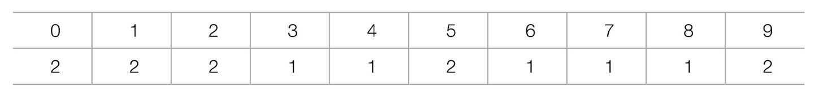

# 정렬

데이터를 특정 기준에 따라 순서대로 나열한 것

상황에 적절하지 못한 정렬 알고리즘을 이용하면 프로그램은 비효율적으로 동작하며 필요 이상의 시간을 소요합니다.

면접에서도 자주 출제되는 문제입니다.

## 선택 정렬
- 가장 작은 데이터를 맨 앞에 있는 데이터와 변경하고, 그 다음 작은 데이터를 선택해 앞에서 두 번째 데이터와 바꾸는 과정의 반복

다음 그림과 같습니다.


### 시간 복잡도

원소의 개수를 N개라고 가정합니다.

- N - 1 번 만큼 가장 작은 수를 찾아 맨 앞으로 보냅니다.
- 위의 그림대로 구현 시 연산 횟수는 N + (N - 1) + (N - 2) + ... + 2 입니다. 해당 근사치로 N * (N + 1) / 2 번의 연산을 수행합니다.
- O(N^2)

선택 정렬 알고리즘의 경우 비효율적이지만 특정 리스트에서 가장작은 데이터를 찾는 일은 코딩 테스트에서 잦기 떄문에 선택 정렬 소스코드에 익숙해져야합니다.

#### 선택 정렬 소스코드

c++로 짜여진 선택 정렬 코드입니다.

```
#include <bits/stdc++.h>

using namespace std;

int n = 10;
int arr[10] = {7, 5, 9, 0, 3, 1, 6, 2, 4, 8};

int main(void) {
    for (int i = 0; i < n; i++) {
        int min_index = i; // 가장 작은 원소의 인덱스 
        for (int j = i + 1; j < n; j++) {
            if (arr[min_index] > arr[j]) {
                min_index = j;
            }
        }
        swap(arr[i], arr[min_index]); // 스와프
    }
    for(int i = 0; i < n; i++) {
        cout << arr[i] << ' ';
    }
}
```

## 삽입 정렬

- 선택 정렬에 비해 구현 난이도가 높은 편이지만 실행 시간 측면에서 효율적인 알고리즘
- 데이터를 하나씩 확인하며, 각 데이터를 적절한 위치에 삽입
- 필요할 때에만 위치를 바꾸므로 데이터가 정렬되었을 때 효율적


위 그림처럼 오른쪽으로 하나씩 증가하며 데이터를 정렬하는 과정을 가집니다. 즉, 지나간 곳은 정렬된 상태로 유지됩니다.

### 시간 복잡도
- O(N^2)
- 거의 정렬되어 있는 상태인 최선의 경우 O(N)

#### 삽입 정렬 소스 코드

```
#include <bits/stdc++.h>

using namespace std;

int n = 10;
int arr[10] = {7, 5, 9, 0, 3, 1, 6, 2, 4, 8};

int main(void) {
    for (int i = 1; i < n; i++) {
        // 인덱스 i부터 1까지 감소하며 반복하는 문법
        for (int j = i; j > 0; j--) {
            // 한 칸씩 왼쪽으로 이동
            if (arr[j] < arr[j - 1]) {
                swap(arr[j], arr[j - 1]);
            }
            // 자기보다 작은 데이터를 만나면 그 위치에서 멈춤
            else break;
        }
    }
    for(int i = 0; i < n; i++) {
        cout << arr[i] << ' ';
    }
}
```

## 퀵 정렬
- 정렬 알고리즘 중 가장 많이 사용되는 알고리즘 중 하나
- 기준 데이터(Pivot)를 설정하고 그 기준보다 큰 데이터와 작은 데이터으 ㅣ위치를 바꿉니다. 


1. 첫번째 데이터를 피벗으로 설정합니다.


2. 이후에 왼쪽에서 부터 피벗보다 큰 데이터 7을 선택하고 오른쪽에서부터 피벗보다 작은 데이터인 4가 선택하여 두 데이터의 위치를 변경합니다.


3. 그 다음 다시 피벗보다 크고 작은 데이터를 찾아 변경합니다.


4. 2, 3의 과정을 반복하다가 왼쪽에서 찾는 값과 오른쪽에서 찾는 값이 엇갈리는 경우 작은 데이터와 피벗 데이터를 변경하여 **분할**을 수행합니다.


해당 과정을 통해 5를 기준으로 왼쪽 데이터는 모두 작고, 오른족 데이터는 모두 크다.

이후 왼쪽 리스트와 오른쪽 리스트 또한 동일하게 진행하여 정렬을 마칩니다.

### 퀵 정렬 시간복잡도

- 평균 시간 복잡도 O(NlogN)
- log인 이유는 피벗 값의 위치가 변경되어 분할이 일어날 때 주로 절반씩 분할되기 떄문
- 데이터가 N개 인 경우 logN을 의미합니다.
- 이미 정렬된 경우인 최악의 경우 O(N^2)

#### 퀵 정렬 소스코드
```
#include <bits/stdc++.h>

using namespace std;

int n = 10;
int arr[10] = {7, 5, 9, 0, 3, 1, 6, 2, 4, 8};

void quickSort(int* arr, int start, int end) {
    if (start >= end) return; // 원소가 1개인 경우 종료
    int pivot = start; // 피벗은 첫 번째 원소
    int left = start + 1;
    int right = end;
    while (left <= right) {
        // 피벗보다 큰 데이터를 찾을 때까지 반복
        while (left <= end && arr[left] <= arr[pivot]) left++;
        // 피벗보다 작은 데이터를 찾을 때까지 반복
        while (right > start && arr[right] >= arr[pivot]) right--;
        // 엇갈렸다면 작은 데이터와 피벗을 교체
        if (left > right) swap(arr[pivot], arr[right]);
        // 엇갈리지 않았다면 작은 데이터와 큰 데이터를 교체
        else swap(arr[left], arr[right]);
    }
    // 분할 이후 왼쪽 부분과 오른쪽 부분에서 각각 정렬 수행
    quickSort(arr, start, right - 1);
    quickSort(arr, right + 1, end);
}

int main(void) {
    quickSort(arr, 0, n - 1);
    for (int i = 0; i < n; i++) {
        cout << arr[i] << ' ';
    }
}

```

#### 제공되는 정렬 라이브러리들

필자가 사용햘 C++은 퀵 정렬을 기반으로 작성된 정렬 라이브러리인 <algorithm>에서의 sort 함수가 제공됩니다.

## 계수 정렬
- 데이터의 크기 범위가 제한되어 정수로 표현할 수 있다는 조건이 부합할 때만 사용할 수 있지만 매우 빠른 정렬 알고리즘
- 실수형 데이터가 주어지는 경우는 사용 불가능하고, max - min 의 데이터가 1000000을 넘지 않을 떄 효과적
- 위의 정렬처럼 비교 기반의 정렬 알고리즘이 아닙니다.
- 기수 정렬을 이용한 코테 문제는 잘 나오지 않습니다.

다음 그림의 배열이 존재한다고 가정해봅니다.


1. 가장 큰 데이터와 가장 작은 데이터를 확인하여 데이터 범위를 확인합니다. 위 예시에서는 0~9 입니다.
2. 데이터를 하나씩 확인하며 각 데이터가 몇 번 등장했는지 횟수를 기록합니다.


3. 이후 작은 데이터 순으로 개수만큼 출력합니다.

최종 결과 : 0 0 1 1 2 2 3 4 5 5 6 7 8 9 9

### 시간 복잡도
데이터의 개수가 N, 데이터 중 최댓값이 K 인 경우
- O(N + K)
- 리스트에서 적절한 인덱스의 값을 1씩 증가시키고 데이터의 최댓값 크기만큼 반복 수행하기 때문에 빠릅니다.


#### 계수 정렬 공간 복잡도
계수 정렬은 때에 따라 심각한 비효율성을 초래합니다.

데이터가 0, 999999/ 단 2개만 존재한다면 리스트의 크기를 100만 까지 선언해야합니다.

#### 계수 정렬 소스코드
```
#include <bits/stdc++.h>
#define MAX_VALUE 9

using namespace std;

int n = 15;
// 모든 원소의 값이 0보다 크거나 같다고 가정
int arr[15] = {7, 5, 9, 0, 3, 1, 6, 2, 9, 1, 4, 8, 0, 5, 2};
// 모든 범위를 포함하는 배열 선언(모든 값은 0으로 초기화)
int cnt[MAX_VALUE + 1];

int main(void) {
    for (int i = 0; i < n; i++) {
        cnt[arr[i]] += 1; // 각 데이터에 해당하는 인덱스의 값 증가
    }
    for (int i = 0; i <= MAX_VALUE; i++) { // 배열에 기록된 정렬 정보 확인
        for (int j = 0; j < cnt[i]; j++) {
            cout << i << ' '; // 띄어쓰기를 기준으로 등장한 횟수만큼 인덱스 출력
        }
    }
}
```

## 코딩 테스트에서 정렬 알고리즘이 사용되는 경우 3가지
- 정렬 라이브러리로 풀 수 있는 문제 : 정렬기법을 알고 있는지 묻는 문제로 정렬 라이브러리 사용방법 숙지
- 정렬 알고리즘의 원리에 대해 물어보는 문제 : 정렬 알고리즘의 원리를 알아야 합니다.
- 더 빠른 정렬이 필요한 문제 : 비교 기반 알고리즘으로는 풀 수 없으며 계수 정렬을 이용하거나 기존 알고리즘의 구조적 개선을 거쳐야 함.