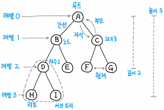
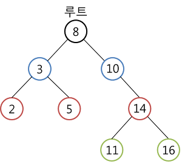

# 이진 탐색

리스트 내에서 데이터를 매우 빠르게 탐색하는 알고리즘으로 범위를 반씩 좁혀가는 탐색의 종류입니다.

해당 내용을 알기 전에 **순차 탐색** 에 대해 알아보겠습니다.

## 순차 탐색

데이터 N개가 리스트내에 존재할 때 그 데이터들을 차례대로 하나씩 확인해 처리하는 경우입니다.

- 정렬 되지 안히은 리스트에서 데이터를 찾는 경우 사용합니다.

### 코드

```
#include <iostream>
#include <string>
#include <vector>
using namespace std;


int sequential_search(int N, string target, vector<string> arr) {
    for (int i = 0; i < N; i++) {
        if (arr[i] == target) {
            return i + 1;
        }
    }
    return -1;
}

int N;
string target;
vector<string> arr;

int main() {
    cin >> N >> target;

    for (int i = 0; i < N; i++) {
        string input;
        cin >> input;
        arr.push_back(input);
    }

    cout << sequential_search(N, target, arr) << endl;
}

```

### 시간 복잡도
- 최악의 경우 O(N)


## 이진 탐색
리스트 내부의 데이터가 정렬되어 있어야만 사용할 수 있는 알고리즘으로 정렬된 경우 매우 빠르게 데이터를 찾을 수 있습니다.
탐색 범위를 절반씩 좁혀가며 데이터를 탐색합니다.

- 탐색 시 위치를 나타내는 변수
    - 시작점
    - 끝점
    - 중감점

찾으려는 데이터와 중감점 위치의 데이터를 반복적으로 비교하여 찾고자 하는 데이터를 찾습니다.

### 시간 복잡도
- 절반씩 데이터를 줄어드도록 하는 점에서 O(logN)

### 코드

- 재귀 함수 이용
```
#include <vector>
#include <iostream>
using namespace std;

int binary_search(vector<int> arr, int target, int start, int end) {
    int mid;
    if (start > end) {
        return -1;
    }

    mid = int((start + end) / 2);

    if (arr[mid] == target)
        return mid;
    else if (arr[mid] > target)
        return binary_search(arr, target, start, mid-1);
    else 
        return binary_search(arr, target, mid+1, end);
 
}

int main() {

    vector<int> arr;
    int n, target, num, result;

    cin >> n >> target;

    for (int i = 0; i < n; i++) {
        cin >> num;
        arr.push_back(num);
    }
    
    result = binary_search(arr, target, 0, n-1);
    if (result == -1) {
        cout << "No elements int arr" << endl;
    } else {
        cout << result + 1 << endl;
    }
    

    return 0;
}
```

- 반복문 활용 이진 탐색
```
#include <vector>
#include <iostream>
using namespace std;

int binary_search(vector<int> arr, int target, int start, int end){
    int mid, first = start, last = end;

    while (first <= last) {
        mid = int((first + last)/2);

        if (arr[mid] == target) {
            return mid;
        } else if (arr[mid] > target) {
            last = mid - 1;
        } else if (arr[mid] < target){
            first = mid + 1;
        }
    }

    return -1;
}

int main() {
    vector<int> arr;
    int n, target, num, result;

    cin >> n >> target;

    for (int i = 0; i < n; i++) {
        cin >> num;
        arr.push_back(num);
    }

    result = binary_search(arr, target, 0, n-1);
    if (result == -1) {
        cout << "No elements in arr" << endl;
    } else {
        cout << result + 1<< endl;
    }
    return 0;
}
```

## 코테에서의 이진 탐색
앞의 코드들에서의 이진 탐색은 쉽게 느낄 수 있지만 이런 소스코드가 없다면 이를 구현하는 것은 어렵다.
실제 존 벤틀리의 말에 따르면 이를 제대로 구현하는 프로그래머는 10% 내외라고 할 정도이다.

하지만 코테에서 이진 탐색은 단골로 나오는 문제이니 이를 자주 접하고 구현해보면서 외울 수 있어야 한다.

특히, 높은 난이도의 문제에서 다른 알고리즘과 함께 사용되기도 한다. 그리고 탐색 범위가 커질 수록 이를 잘 떠올리도록 해야한다.

## 트리 자료구조

노드와 노드의 연결로 이를 표현합니다.
이는 그래프의 자료구조의 일종으로 데이터베이스 시스템이나 파일 시스템 같은 곳에서 많은 양의 데이터를 관리하기 위한 목적으로 사용됩니다.



#### 특징
- 트리는 부모 노드와 자식 노드의 관계로 표현
- 최상단 노드는 **루트 노드**
- 최하단 노드는 **단말 노드**
- 트리에서 일부를 떼어도 노드이며 이는 **서브 트리**라고 표현
- 계층적이고 정렬된 데이터를 다루기 적합

### 이진 탐색 트리
트리 자료구조의 한 형태로 가장 간단한 형태입니다.
이진 탐색이 동작할 수 있도록 고안되어 효율적인 탐색이 가능한 자료구조입니다.

#### 이진 탐색 트리 특징
- 왼쪽 자식 노드 < 부모 노드 < 오른쪽 자식 노드